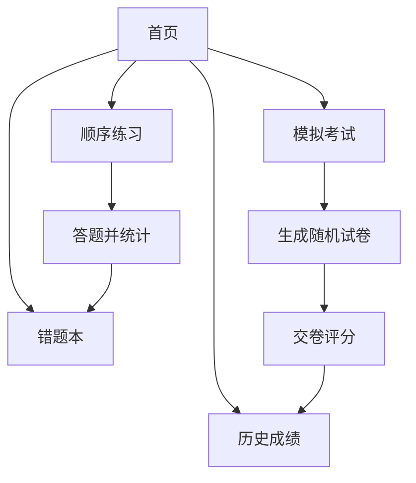

根据您的需求，我将为您生成一份详细的**网页应用需求规格说明书**，涵盖功能、设计、数据结构和实现思路。

---

# **执法资格考试在线练习与模拟考试系统需求规格说明书**

## **1. 项目概述**
基于基本级执法资格考试题库，开发一个在线网页应用，支持顺序练习、错题统计、模拟考试和历史成绩查看功能。

---

## **2. 功能需求**

### **2.1 顺序练习模块**
- **功能描述**：用户按题库顺序逐题作答。
- **子功能**：
  - 显示题目内容、选项。
  - 用户选择答案后，立即显示正确答案。
  - 自动记录用户答题情况（正确/错误）。
- **输出**：
  - 当前答题进度（如：第1题/总题数）。
  - 实时统计正确数、错误数。

### **2.2 错题统计模块**
- **功能描述**：记录用户答错的题目，支持错题重做。
- **子功能**：
  - 错题列表展示（题目、用户答案、正确答案）。
  - 支持从错题列表中移除已掌握的题目。

### **2.3 模拟考试模块**
- **功能描述**：从题库中随机抽取100道题，模拟真实考试环境。
- **子功能**：
  - 随机生成试卷（题目顺序随机）。
  - 计时功能（可选，如2小时倒计时）。
  - 交卷后自动评分，显示得分和错题解析。
- **输出**：
  - 总分（百分制）。
  - 各题答案对比（用户答案 vs 正确答案）。

### **2.4 历史成绩模块**
- **功能描述**：记录用户每次模拟考试的成绩。
- **子功能**：
  - 以列表形式展示历史模拟考试记录（日期、得分）。
  - 点击可查看当次考试的详细答题情况。


## **3. 页面结构与交互设计**

### **3.1 页面结构**
1. **首页**：
   - 导航菜单（顺序练习、模拟考试、错题本、历史成绩）。
   - 数据概览（当前正确率、模拟考试平均分）。
2. **顺序练习页**：
   - 题目区域（题干、选项按钮）。
   - 进度条、正确/错误计数。
   - “上一题”/“下一题”按钮。
3. **模拟考试页**：
   - 全屏模式，显示倒计时。
   - 题目区域与选项。
   - “交卷”按钮。
4. **成绩报告页**：
   - 总分、各题型正确率。
   - 错题列表与解析。
5. **错题本页**：
   - 错题列表，支持按标签（题型）筛选。
   - “移出错题本”按钮。

### **3.2 交互流程**


---

## **4. 数据结构设计**

### **4.1 题目数据格式（JSON）**
```json
{
  "id": 1,
  "type": "multiple", // "multiple"多选题、"judge"判断题、"single"单选题
  "question": "全国人民代表大会常务委员会成员不得担任下列哪些职务？",
  "options": [
    "A.国家监察委员会委员",
    "B.最高人民法院副院长",
    "C.最高人民检察院检察长",
    "D.国务院副总理"
  ],
  "answer": ["A", "B", "C", "D"]
}
```

### **4.2 用户数据存储（LocalStorage）**
- **userProgress**：记录练习进度、错题ID列表。
- **examHistory**：存储历次模拟考试的成绩和答题详情。

---


